# Armor_Finder

## This repository contains codes for Roboter Armor Plate Identification Program in the DJI Robomaster Robotics Competition

| Author   |  Responsible part |
| ------ | -------------- |
| Xuyuan Han | Armor Plate Recognition and Classifier |
| Xiankun Zeng | PNP Ranging |

- In this program the Identification of Roboter Armor Plate will be achieved by using OpenCV to implement functions, such as image processing and image classifier.


## 1. Environment

|Operating System|Runtime Library|
|-------|--------|
|Ubuntu16.04<br />Windows WSL|OpenCV 3.4.7<br />cmake 3.15.4|

- The images with size of **640×480** are used for image processing.

## 2. Program Compilation and Running

Ubuntu16.04（under the project folder）

```shell
mkdir build
cd build
cmake ..
make
sudo ./main
```

## 3. Files Structure

``` Files Structure
.
├── armor                   // main code of auto-aiming
│   ├── include             // auto-aiming header files
│   └── src                 // auto-aiming source code
├── CMakeLists.txt          // cmake project files
├── image                   // the image used by the test code
│   ├── dst                 // the original image
│   └── src                 // the image after process
├── main.cpp                // main.cpp
├── other                   // some other codes, such as timer, drawText
│   └── include             // other header files
├── README.md               // 
└── Video                   // the video files used for debugging the code and the screenshots of the classifier output
```

## 4. Operation Process of the Armor Plate Identification Program

- First perform hsv binarization on the image: assign the pixels that match the hsv color of the armor plate light bar to white, and assign other pixels to black, and use median filtering to make the image smooth
- Use edge extraction to obtain a rotating rectangular area that may be a light bar
- Filter out the light bar rectangle according to the aspect ratio of the rotated rectangle and the hsv brightness of the pixels of the rotated rectangle corresponding to the original image area
- Perform pairwise matching of all possible light bars, and filter according to the angle between the two light bars, the height ratio of the two light bars, the height difference between the centers of the two light bars, and the ratio of the distance between the centers of the two light bars aiiind the height of the light bars. Then we get the qualified light bar pairs.
- Extend the four outer vertices of the light bar pair up and down to the edge of the armor plate in proportion to get the armor plate quadrilateral
- Perform affine transformation on the screenshot of the quadrilateral area of the armor plate to obtain the armor plate image and submit it to the classifier to determine the armor plate and its ID
- Finally, put the framed armor plate quadrilateral into PNP to calculate the distance and angle

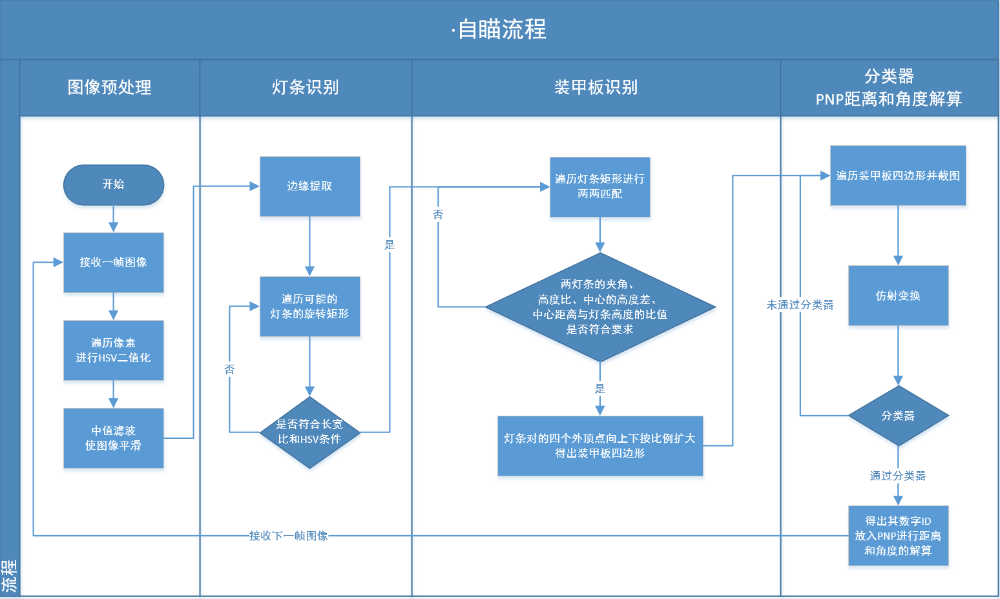

## 6. code naming conventions

- Function name: use the camel case nomenclature with the first letter lowercase
- Type name: use the camel case nomenclature with the first letter capitalized
- Variable name: use underscore  separating  nomenclature

# ORB-Based Dual Cascade Classifier

## 1. Classifier -- old version

> Using pointers to traverse the armor plate template and the image of the input classifier (grayscaled + binarized) to increase or decrease the gain value  
> uchar* p_src_grey = src_grey.ptr<uchar>(i)

| Category           | gain         |
| ----------------- | ------------ |
| Corresponding pixels are the same as 255 | gain+=3      |
| Corresponding pixels are different    | gain-=2      |
| Corresponding pixels are the same as 0   | gain remains unchanged |

### 2. The advantage of this classifier is fast, but the disadvantages are obvious: too simple and low accuracy, it is difficult to judge whether the two matched light bars belong to the same armor plate

#### [1] Often match two light bars belonging to different armor plates on the same car, such as:

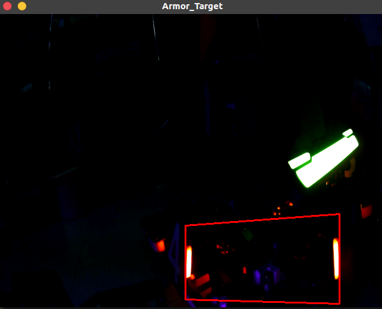

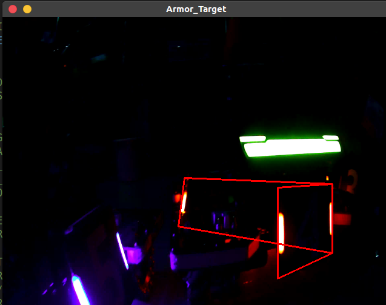

#### 【2】Or match light bars belonging to different cars together, such as:

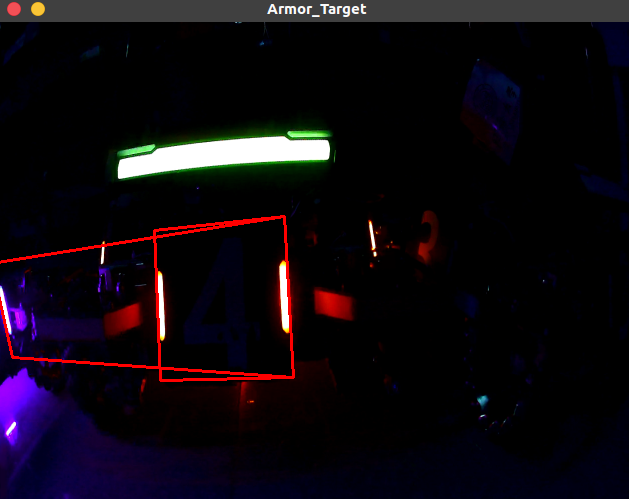

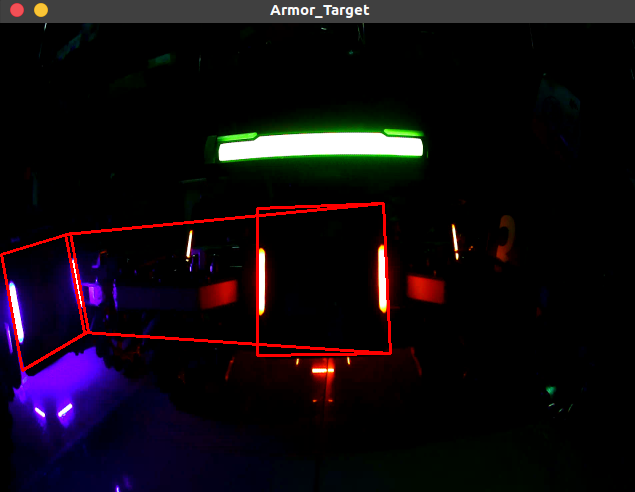

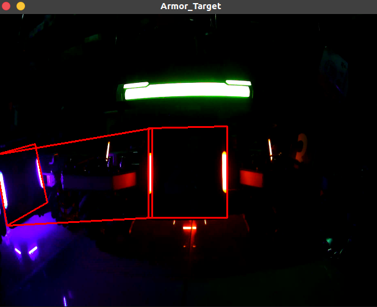

## 二、ORB-based Dual Cascade Classifier

### 1. Solutions to the shortcomings of existing classifiers

- Use the existing classifier as the first-level classifier for rough classification, and initially calculate the number of armor plates corresponding to the picture entering the classifier
- At the same time, the classifier based on the ORB feature recognition algorithm is used as the second-level classifier for subdivision
- The second-level classifier checks the results of the first-level classifier, and secondly filters out the classification results that do not meet the requirements

### 2. Reasons for adopting dual cascade classifier

- The classifier based on ORB feature detection can achieve high recognition accuracy, but its operation speed is slow
  - For 120*100 images, a good recognition effect can be achieved, but the calculation time for each image is about 1~2ms
  - If the ORB classifier is used as the first-level classifier, it will take 15+ms to compare which number of armor plates the image entered into the classifier belongs to by traversing the feature values ​​of the existing template image, even if the result is accurate , But very time-consuming

- The dual cascade classifier can not only make full use of the fast recognition speed of the existing classifier, but also does not lose the advantage of the high accuracy of the ORB classifier
  - If the recognition result of the first-level classifier is imported into the second-level ORB classifier, the ORB classifier only needs to perform feature recognition operations on this picture, which reduces the program running time

## 三、ORB classifier code implementation

### 1. The first-level classifier header file

```C++
#pragma once

#include <string>
#include <vector>
#include <utility>
#include <iostream>
#include <fstream>
#include <algorithm>
#include <opencv2/opencv.hpp>
#include "proportion_thresh.hpp"
#include <chrono>
# include "../../../../other/include/timer.hpp"

namespace sp //Use the namespace sp
{
bool ORB_classifier_isok(const cv::Mat& img2);

int classifier(const cv::Mat& src, std::string template_filename_list) 
//src is to intercept mat from the original image, template_filename_list is to store the file name of the template file
{
	#ifdef PRINT_CLASSIFIER_RUNTIME
    sp::timer timer_classifier; //Create timer
    timer_classifier.reset(); // start timing
	#endif

	// preprocess the captured image
	#ifdef DEBUG_CLASSIFIER
	std::cout << " " << std::endl;
	std::cout << "Start Classification" << std::endl;
	#endif

    cv::cvtColor(src, src, CV_RGB2HSV); //Convert to HSV
		
	#ifdef SHOW_CLASSIFIER_IMAGE
	cv::imshow("SHOW_CLASSIFIER_IMAGE_HSV", src);
	#endif

	double thresh_binar = 0.85; //Binarize and take the brightest part of thresh_binar

	#ifdef DEBUG_CLASSIFIER
	std::cout << " " << std::endl;
	std::cout << "Successfully set the binarization threshold" << std::endl;
	#endif

	cv::Mat src_grey;
	cv::cvtColor(src, src_grey, CV_RGB2GRAY); //Convert the captured image to grayscale

	#ifdef DEBUG_CLASSIFIER
	std::cout << " " << std::endl;
	std::cout << "Successfully captured the grayscale image" << std::endl;
	#endif

	sp::proportion_thresh(src_grey, src_grey, 255, thresh_binar); //binarize the captured image

	#ifdef DEBUG_CLASSIFIER
	std::cout << " " << std::endl;
	std::cout << "Successfully captured the binarized image" << std::endl;
	#endif

	#ifdef SHOW_ARMOR_IMAGE
	cv::imshow("src_grey",src_grey);
	#endif
	
	int rows = src_grey.rows;
	int cols = src_grey.cols;

	rows = CLASSIFIER_IMAGEPART_ROWS;
	cols = CLASSIFIER_IMAGEPART_COLS;

	cv::resize(src_grey, src_grey, cv::Size(cols, rows), (0,0), (0,0), CV_INTER_AREA);

	#ifdef SHOW_CLASSIFIER_IMAGE
	cv::imshow("SHOW_CLASSIFIER_IMAGE_GREY", src_grey);
	#endif

	// read in template image file
	std::ifstream template_filename_in(template_filename_list); //Read in template image file name file
	std::string template_filename;
	
	int gain = 0; //initialize gain
	std::vector<int> gain_list; //Declare the container gain_list to place the gain of each image
	int count_armor = 1;

	while(getline(template_filename_in, template_filename))
	{
		// Template image preprocessing
		cv::Mat template_image = cv::imread(template_filename); //Read in template image

		cv::Mat template_image_grey;
		cv::cvtColor(template_image, template_image_grey, CV_RGB2GRAY); //Gray template image
		sp::proportion_thresh(template_image_grey, template_image_grey, 255, thresh_binar); //binarize template image

		// 将模板图像的大小变成CLASSIFIER_IMAGEPART_COLS*CLASSIFIER_IMAGEPART_ROWS
		cv::resize(template_image_grey, template_image_grey, cv::Size(cols, rows), (0,0), (0,0), CV_INTER_AREA);
		
		#ifdef DEBUG_CLASSIFIER
		std::cout << "读入" << count_armor << "号装甲板模板" << std::endl;
		#endif

		// 逐像素获取每个像素的gain并累积
		for(int i=0; i<rows; i++)
		{
			//获取第i行首像素指针
			uchar* p_template_image_grey = template_image_grey.ptr<uchar>(i);
			uchar* p_src_grey = src_grey.ptr<uchar>(i);

			//对第i行的每个像素（Byte）进行操作
			for(int j=0; j<cols; j++)
			{
				//这是用指针访问像素的方法（速度快）
				if(p_template_image_grey[j]==255 
				&& p_src_grey[j]==255)
				{
					gain += 3;
				}
				else if(p_template_image_grey[j]
				 != p_src_grey[j])
				{
					gain -= 2;
				}
				else{}
			

				// // 这是用.at()函数的代码（速度慢）
				// if(template_image_grey.at<uchar>(i,j)==255 && src_grey.at<uchar>(i,j)==255)
				// {
				// 	gain += 3;
				// }
				// else if(template_image_grey.at<uchar>(i,j) != src_grey.at<uchar>(i,j))
				// {
				// 	gain -= 2;
				// }
				// else{}
			}
		}
		gain_list.push_back(gain); //将gain加入gain_list

		#ifdef DEBUG_CLASSIFIER
		std::cout << count_armor << "号装甲板的gain是" << gain << std::endl; //显示gain
		#endif

		gain = 0; //重置gain
		count_armor++;
	}

	auto min = std::min_element(gain_list.begin(), gain_list.end());
	auto max = std::max_element(gain_list.begin(), gain_list.end());

	#ifdef DEBUG_CLASSIFIER
	std::cout << "这组图像的最小gain是" << *min << std::endl;
	std::cout << "这组图像的最大gain是" << *max << std::endl;
	#endif

	std::string filePath;
	filePath.clear();

	sp::timer timer_now;
	long long int count_classifier_int(timer_now.getTimeStamp());
	std::string count_classifier_str = std::to_string(count_classifier_int);

	if(*max<1000)
	{
		#ifdef DEBUG_CLASSIFIER
		std::cout << "舍弃" << std::endl;
		#endif

		#ifdef CLASSIFIER_OUTPUT
		filePath = "../Video/image/dst/negative/negative_1_"+count_classifier_str+".jpg";
		cv::imwrite(filePath, src_grey);

		#ifdef DEBUG_CLASSIFIER
		std::cout << "输出negative图片成功" << std::endl;
		#endif

		#endif

		#ifdef PRINT_CLASSIFIER_RUNTIME
	    std::cout << "> 一级分类器运行时间：" << timer_classifier.get() << "ms" << std::endl; //结束计时
		#endif

		return 0;
	}
	else
	{
		int maxGainArmor = (max_element(gain_list.begin(),gain_list.end()) - gain_list.begin()) + 1;

		#ifdef DEBUG_PRINT_ARMORNUM
		std::cout << "对应编号为" << maxGainArmor << "的装甲板" << std::endl;
		#endif

		#ifdef PRINT_CLASSIFIER_RUNTIME
	    std::cout << "> 一级分类器运行时间：" << timer_classifier.get() << "ms" << std::endl; //结束计时
		#endif

		if(ORB_classifier_isok(src_grey) //使用ORB分类器
		)
		{
			#ifdef DEBUG_CLASSIFIER_ORB
		    std::cout << "> 一级分类器接受到ORB返回的true" << std::endl; 
			#endif

			#ifdef CLASSIFIER_OUTPUT
			filePath = "../Video/image/dst/positive/positive_"+count_classifier_str+".jpg";
			cv::imwrite(filePath, src_grey);
			#ifdef DEBUG_CLASSIFIER
			std::cout << "输出positive图片成功" << std::endl;
			#endif
			#endif

			return maxGainArmor;
		}
		else
		{
			#ifdef CLASSIFIER_OUTPUT
			filePath = "../Video/image/dst/negative/negative_2_"+count_classifier_str+".jpg";
			cv::imwrite(filePath, src_grey);
			#ifdef DEBUG_CLASSIFIER
			std::cout << "输出negative图片成功" << std::endl;
			#endif
			#endif
			
			#ifdef DEBUG_CLASSIFIER_ORB
		    std::cout << "> 一级分类器接受到ORB返回的false" << std::endl; 
			#endif
			
			return 0;
		}
	}
}
}
```

### 2. 二级ORB分类器头文件
```C++
#pragma once

#include <opencv2/xfeatures2d.hpp>

#define DRAW_IMAGE_FEATURE_MATCH

namespace sp //使用命名空间sp
{
bool ORB_classifier_isok(const cv::Mat& img2)
{
    #ifdef PRINT_CLASSIFIER_RUNTIME
    sp::timer timer_classifier_orb; //建立计时器
    timer_classifier_orb.reset(); // 开始计时
	#endif

    try
    { 
    //【1】载入原图片并显示+载入的图像是二值化之后的图像
    //img1是模板图像，img2是待检测图
    cv::Mat img1 = cv::imread("../Video/image/src/armor/T4.jpg",0);
    if(!img1.data||!img2.data)//检测图片是否读取成功
    {
        std::cout<<"读取图片错误，请确定目录下是否存在该图片"<<std::endl;
    }
    // cv::medianBlur(img1, img1, 3); //中值滤波
    // cv::medianBlur(img2, img2, 3); //中值滤波

    //【2】定义需要用到的变量和类
    cv::Ptr<cv::ORB> detector = cv::ORB::create(200,1.2); //定义一个ORB特征检测类对象detector
    std::vector<cv::KeyPoint> keypoint_1, keypoint_2;//放置特征点
    cv::Mat descriptors_1, descriptors_2;

    //【3】调用detect函数检测出SURF特征关键点，保存在vector容器中
    detector->detectAndCompute(img1,cv::Mat(),keypoint_1,descriptors_1);
    detector->detectAndCompute(img2,cv::Mat(),keypoint_2,descriptors_2);
    
    #ifdef DEBUG_CLASSIFIER_ORB
    if(!descriptors_1.data)
    {
        std::cout<<"> descriptors_1无内容"<<std::endl;
    }
    if (!descriptors_2.data)
    {
        std::cout<<"> descriptors_2无内容"<<std::endl;
    }
    #endif
    
    //【4】基于FLANN的描述符对象匹配
    std::vector<cv::DMatch> matches;
    // 初始化flann匹配
    cv::flann::Index flannIndex(descriptors_1, cv::flann::LshIndexParams(12,20,2), cvflann::FLANN_DIST_HAMMING);

    //【5】匹配和测试描述符，获取两个最邻近的描述符
    cv::Mat matchIndex(descriptors_1.rows, 2, CV_32SC1);
    cv::Mat matchDistance(descriptors_1.rows, 2, CV_32FC1);

    flannIndex.knnSearch(descriptors_2, matchIndex, matchDistance, 2, cv::flann::SearchParams());//调用K邻近算法

    //【6】根据劳氏算法(Low's algorithm)选出优秀的匹配
    std::vector<cv::DMatch> good_matches;
    for(int i=0;i<matchDistance.rows;i++)
    {
        if(matchDistance.at<float>(i,0) < 0.6*matchDistance.at<float>(i,1))
        {
            cv::DMatch dmatches(i, matchIndex.at<int>(i,0), matchDistance.at<float>(i,0));
            good_matches.push_back(dmatches);
        }
    }

    //【7】绘制并显示匹配窗口
    cv::Mat img_matches;
    cv::drawMatches(img2,keypoint_2,img1,keypoint_2,good_matches,img_matches);

    // 【8】输出相关匹配点信息
    for(int i=0;i<good_matches.size();i++)
    {
        std::cout<<"> 符合条件的匹配点 "<<i<<" 特征点1："<<good_matches[i].queryIdx<<" -- 特征点2："<<good_matches[i].trainIdx<<std::endl;
    }
    
    // 【9】打印特征信息
    std::cout<<"> img1检测到特征点"<<keypoint_1.size()<<"个"<<std::endl;
    std::cout<<"> img2检测到特征点"<<keypoint_2.size()<<"个"<<std::endl;
    #ifdef DEBUG_CLASSIFIER_ORB
    std::cout<<"> 共匹配到特征点"<<good_matches.size()<<"对"<<std::endl;
    #endif

    //【10】绘制特征图像
    #ifdef DRAW_IMAGE_FEATURE_MATCH
    cv::Mat img1_keypoint, img2_keypoint;
    cv::drawKeypoints(img1,keypoint_1,img1_keypoint);
    cv::drawKeypoints(img2,keypoint_2,img2_keypoint);
    cv::imshow("> 特征点检测效果图1",img1_keypoint);
    cv::imshow("> 特征点检测效果图2",img2_keypoint);
    cv::imshow("匹配效果图",img_matches);
    // cv::waitKey(0);
    #endif

    if(good_matches.size()>1)
    {
        #ifdef PRINT_CLASSIFIER_RUNTIME
	    std::cout << "> 二级分类器运行时间：" << timer_classifier_orb.get() << "ms" << std::endl; //结束计时
		#endif

        return true;
    }
    else
    {
        #ifdef PRINT_CLASSIFIER_RUNTIME
	    std::cout << "> 二级分类器运行时间：" << timer_classifier_orb.get() << "ms" << std::endl; //结束计时
		#endif
        
        return false;
    }
    

    }
    catch (std::exception& e) 
    {
        #ifdef PRINT_CLASSIFIER_RUNTIME
	    std::cout << "> 二级分类器运行时间：" << timer_classifier_orb.get() << "ms" << std::endl; //结束计时
		#endif

        #ifdef DEBUG_CLASSIFIER_ORB
        // std::cout << "> ORB分类器出错:" << std::endl; 
        std::cout << "> ORB分类器出错:" << std::endl <<"> Standard exception: " << std::endl << e.what() << std::endl; 
        std::cout << "> ORB返回false" << std::endl;
        #endif

        return false;
    } 
}
}
```

## 四、双级联分类器运行结果

### 1. 识别精度

#### 【1】positive结果

> 如图所示，在15秒视频识别出的155个positive结果中只有5个属于误识别  
>
> - 即双级联ORB分类器的识别精度约为96.8%

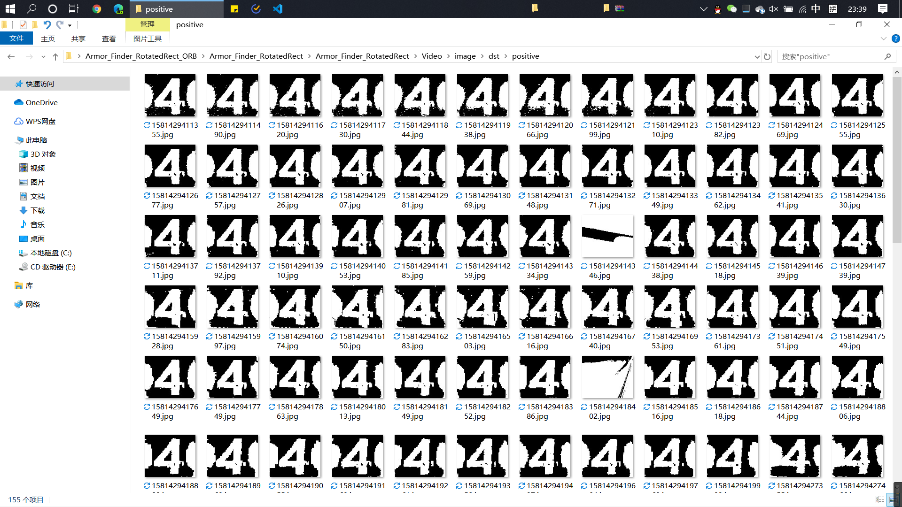

.png)

.png)

#### 【2】negative结果

> 如图所示，negative结果中输出的基本都是负相关分类器截图
> - 但是negative结果中也输出了一些不清楚的装甲板截图
> - 其原因在于此视频录制采用的曝光过低，装甲板上的数字显示得非常模糊，输入ORB分类器的数字残缺不全，导致特征识别出现问题，待回学校后新录视频再做检测

.png)

.png)

.png)

.png)

.png)

#### 【3】运行截图

> 由图像可见，前面在“一、现有分类器的主要缺陷”提到的各种问题已经被避免

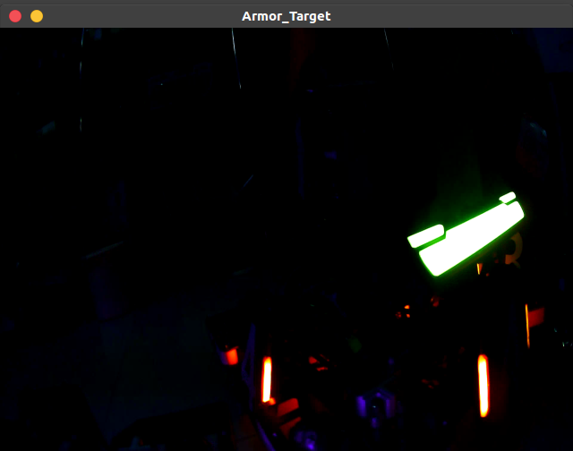

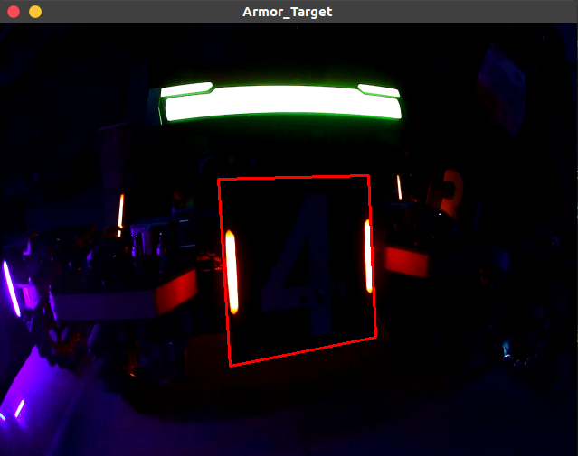

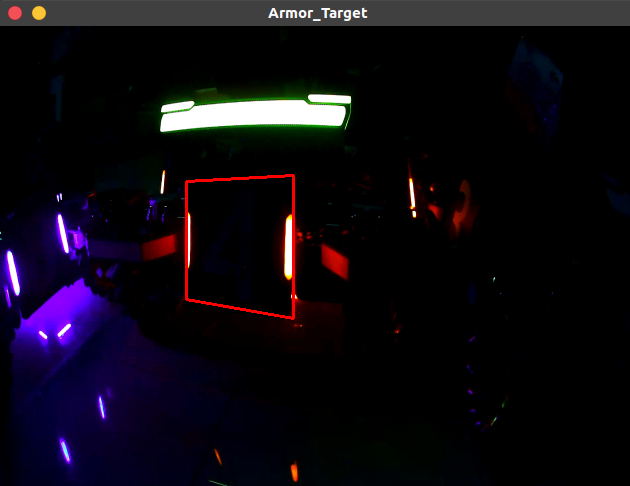

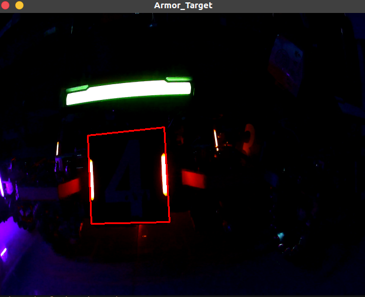

### 2. 识别速度

> 由图可见，一级分类器运行时间约为4ms，二级分类器运行时间约为2ms，每帧程序运行时间约为40ms

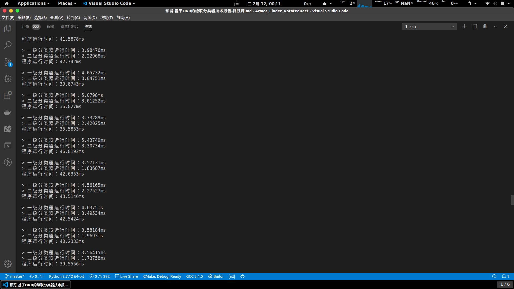

## 五、总结

> 综上所述，基于ORB的双级联分类器可以达到很高的识别精度和较快的运算速度
> 程序中还有一些参数要在实际中调节，以达到更好的效果